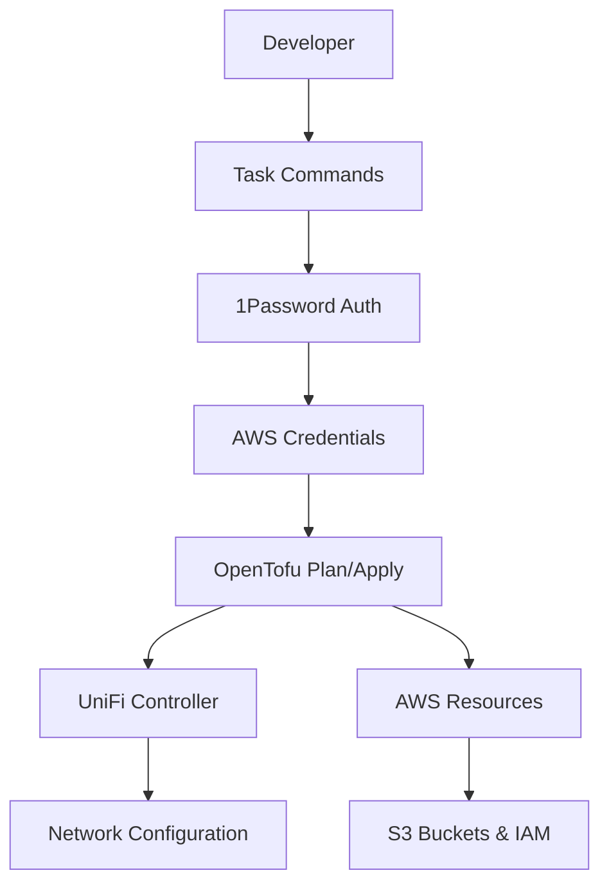
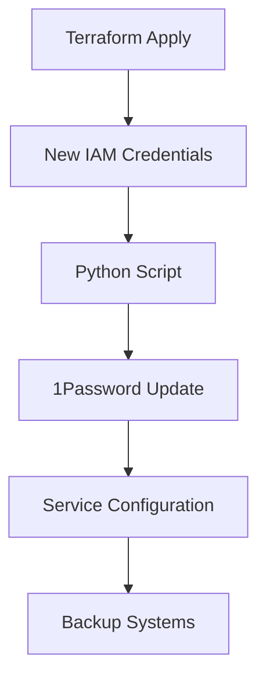
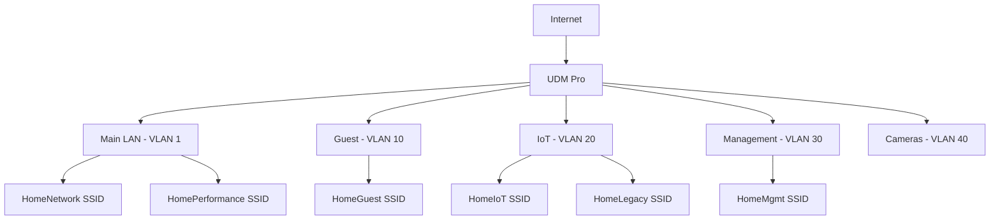

# System Architecture

## Overview

The home-iac project implements a comprehensive Infrastructure as Code solution using OpenTofu to manage both on-premises UniFi networking equipment and AWS cloud resources. The architecture follows a modular design with clear separation of concerns between networking, storage, and credential management.

## Repository Structure

```
.
├── environments/          # Environment-specific configurations
│   └── dev/              # Development environment
│       ├── main.tf       # Provider configuration and locals
│       ├── backend.tf    # S3 + DynamoDB state backend
│       ├── versions.tf   # Provider version constraints
│       ├── variables.tf  # Environment variables
│       ├── s3-buckets.tf # S3 bucket configurations
│       ├── s3-iam-access.tf # IAM access policies
│       ├── unifi-networks.tf # UniFi network configurations
│       ├── unifi-wlans.tf    # UniFi WLAN configurations
│       └── unifi-bgp.tf      # BGP documentation module
├── modules/              # Reusable OpenTofu modules
│   ├── s3-buckets/      # S3 bucket management
│   ├── s3-iam-access/   # IAM access policies
│   ├── unifi-networks/  # UniFi network/VLAN management
│   ├── unifi-wlans/     # UniFi WLAN management
│   └── unifi-bgp/       # BGP documentation (placeholder)
├── scripts/             # Automation and utility scripts
│   ├── lib/            # Python libraries for credential management
│   └── *.sh            # Shell scripts for setup and operations
└── docs/               # Documentation
```

## Core Components

### 1. Infrastructure Modules

#### UniFi Networks Module (`modules/unifi-networks/`)
- **Purpose**: Manages UniFi network and VLAN configurations
- **Key Files**:
  - [`main.tf`](modules/unifi-networks/main.tf:1): Core network resource definitions
  - [`variables.tf`](modules/unifi-networks/variables.tf:1): Network configuration parameters
  - [`outputs.tf`](modules/unifi-networks/outputs.tf:1): Network IDs and metadata
- **Features**:
  - VLAN segmentation (Main LAN, Guest, IoT, Management, Cameras)
  - IPv6 prefix delegation support
  - DHCP configuration per network
  - Network isolation and security policies

#### UniFi WLANs Module (`modules/unifi-wlans/`)
- **Purpose**: Manages WiFi network configurations
- **Key Files**:
  - [`main.tf`](modules/unifi-wlans/main.tf:1): WLAN resource definitions with security validation
  - [`variables.tf`](modules/unifi-wlans/variables.tf:1): WLAN configuration parameters
  - [`outputs.tf`](modules/unifi-wlans/outputs.tf:1): WLAN IDs and security metadata
- **Features**:
  - Multiple SSIDs for different device types
  - WPA3 support with backward compatibility
  - Band-specific configurations (2.4GHz, 5GHz, dual-band)
  - Guest network isolation and MAC filtering

#### S3 Buckets Module (`modules/s3-buckets/`)
- **Purpose**: Manages AWS S3 bucket configurations
- **Key Files**:
  - [`main.tf`](modules/s3-buckets/main.tf:1): S3 bucket resources with lifecycle management
- **Features**:
  - Encryption at rest (AES256)
  - Versioning and lifecycle rules
  - Public access blocking
  - Backup retention policies

#### S3 IAM Access Module (`modules/s3-iam-access/`)
- **Purpose**: Manages IAM permissions for S3 bucket access
- **Features**:
  - Service-specific IAM users and policies
  - Least-privilege access controls
  - Automated credential rotation support

### 2. Environment Configuration

#### Development Environment (`environments/dev/`)
- **Provider Configuration**: AWS, UniFi, 1Password, and Time providers
- **State Management**: S3 backend with DynamoDB locking
- **Network Topology**:
  - Main LAN: 192.168.1.0/24 (VLAN 1)
  - Guest: 192.168.10.0/24 (VLAN 10)
  - IoT: 192.168.20.0/24 (VLAN 20)
  - Management: 192.168.30.0/24 (VLAN 30)
  - Cameras: 192.168.40.0/24 (VLAN 40)

### 3. Automation and Tooling

#### Script Library (`scripts/`)
- **Setup Scripts**: Initial environment configuration
- **Credential Management**: Python-based credential rotation system
- **Discovery Tools**: S3 bucket discovery and import automation
- **Utility Scripts**: Maintenance and operational tasks

#### Credential Management System (`scripts/lib/`)
- **Architecture**: Modular Python framework
- **Components**:
  - [`credential_manager.py`](scripts/lib/credential_manager.py:1): Core credential management logic
  - [`service_configs.py`](scripts/lib/service_configs.py:1): Service-specific configurations
- **Features**:
  - Terraform output integration
  - 1Password storage automation
  - Service-specific credential rotation

## Data Flow Architecture

### 1. Infrastructure Deployment Flow


### 2. Credential Management Flow


### 3. Network Architecture


## Key Design Patterns

### 1. Module Composition
- **Reusable Modules**: Each infrastructure component is a standalone module
- **Environment Composition**: Environments compose modules with specific configurations
- **Dependency Management**: Explicit dependencies between modules using outputs/inputs

### 2. Configuration Management
- **Variable Hierarchy**: Environment → Module → Resource level variables
- **Sensitive Data**: 1Password integration for secrets management
- **Validation**: Input validation at module boundaries

### 3. State Management
- **Remote State**: S3 backend with encryption and versioning
- **State Locking**: DynamoDB table prevents concurrent modifications
- **Environment Isolation**: Separate state files per environment

### 4. Security Architecture
- **Network Segmentation**: VLAN-based isolation between device types
- **Credential Rotation**: Automated AWS credential lifecycle management
- **Access Control**: Least-privilege IAM policies and MAC filtering

## Integration Points

### 1. Sister Repository Integration
- **talos-gitops**: Kubernetes GitOps repository
- **Dependencies**: Network configurations, S3 bucket references
- **Location**: `../talos-gitops` (parallel checkout)

### 2. External Service Integration
- **UniFi Controller**: Network device management at `unifi.home.geoffdavis.com`
- **1Password**: Credential storage and retrieval
- **AWS Services**: S3 storage, IAM management, DynamoDB locking

### 3. Backup System Integration
- **Home Assistant**: Consumes `home-assistant-backups-hassio-pi` bucket
- **Longhorn**: Kubernetes storage backups to `longhorn-backups-home-ops`
- **PostgreSQL**: Database backups with lifecycle management
- **Home Assistant PostgreSQL**: Cloud-Native PostgreSQL backups to `home-assistant-postgres-backup-home-ops`

## Scalability Considerations

### 1. Multi-Environment Support
- **Structure**: Environment-specific directories with shared modules
- **State Isolation**: Separate backends per environment
- **Configuration Drift**: Environment-specific variable files

### 2. Multi-Site Support
- **Architecture**: Site-specific modules with shared networking patterns
- **BGP Integration**: Future support for inter-site routing
- **Credential Management**: Site-specific 1Password vaults

### 3. Service Expansion
- **Module Pattern**: New services follow established module structure
- **Credential Framework**: Extensible credential management system
- **Documentation**: Automated documentation generation

## Critical Implementation Paths

### 1. Network Configuration Path
1. [`environments/dev/unifi-networks.tf`](environments/dev/unifi-networks.tf:1) → Module configuration
2. [`modules/unifi-networks/main.tf`](modules/unifi-networks/main.tf:1) → Resource creation
3. UniFi Controller → Physical network configuration

### 2. WLAN Configuration Path
1. [`environments/dev/unifi-wlans.tf`](environments/dev/unifi-wlans.tf:1) → WLAN definitions
2. [`modules/unifi-wlans/main.tf`](modules/unifi-wlans/main.tf:1) → WLAN resources
3. Network dependency validation → Security policy enforcement

### 3. Credential Rotation Path
1. [`Taskfile.yml`](Taskfile.yml:1) → Task execution
2. OpenTofu apply → New credentials generation
3. [`scripts/lib/credential_manager.py`](scripts/lib/credential_manager.py:1) → 1Password update
4. Service configuration → Backup system integration

## Future Architecture Evolution

### 1. BGP Implementation
- **Current**: Documentation-only module with manual configuration
- **Future**: Full Terraform resource management when provider supports BGP
- **Migration**: Automated conversion from manual to Terraform-managed

### 2. Monitoring Integration
- **Architecture**: Prometheus metrics collection from infrastructure
- **Implementation**: Monitoring module with alerting rules
- **Integration**: Dashboard and notification systems

### 3. Testing Framework
- **Unit Tests**: Module-level validation with Terratest
- **Integration Tests**: End-to-end infrastructure validation
- **Continuous Testing**: Automated testing in CI/CD pipeline